- [CICDフロー説明](#cicdフロー説明)
  - [CodePipeline](#codepipeline)
    - [Sourceステージ](#sourceステージ)
    - [Buildステージ](#buildステージ)
    - [Deployステージ](#deployステージ)

# CICDフロー説明

本レポジトリで構成するCICDについて解説します。全体の流れは以下の通りです。CodeCommitにアプリケーションソースとECSデプロイ設定を配置する2つのレポジトリを用意します。CodePipelineで1つのパイプラインを構成し、その中にCodeBuildでソースをビルドするいわゆる`CI`の部分、CodeDeployでデプロイするいわゆる`CD`の部分を構成します。

## CodePipeline

CodePipelineは3つのステージで構成します。`Source`ステージと`Build`ステージ、`Deploy`ステージです。これらのステージは順番に実行されます。
- `Source`ステージ
  - ビルド・デプロイに必要な情報を取得するステージです。対象のレポジトリにCodePipelineが自動で変更検知を行います
- `Build`ステージ
  - CodeBuildを実行し、アプリケーションソースをビルドしECRにプッシュします。いわゆる`CI`の部分です
- `Deploy`ステージ
  - CodeDeployを実行し、ECSサービスのタスクをBlue/Greenデプロイで更新します。いわゆる`CD`の部分です

  

Sourceステージ・Buildステージは`CI`の部分です。  
Deployステージは`CD`の部分です。  

### Sourceステージ

Sourceステージは2つのソースアクションを定義しています。CodeCommitのアプリケーションソースとECSデプロイ設定を配置したレポジトリに変更があると、それらを取得しパイプライン上で利用できるアーティファクトとして格納します。格納したアーティファクトは次のステージへ引き継がれます。

- アプリケーションソース
  - ソース全体を取得し、`app`という名前のアーティファクトとして格納します
- ECSデプロイ設定
  - ECSデプロイ設定を取得し、`settings`という名前のアーティファクトとして格納します

### Buildステージ
Buildステージは1つのビルドアクションを定義しています。CodeBuildを使用したアプリケーションソースをビルドしECRにプッシュするアクションです。Sourceステージで取得したアーティファクトを使い、CodeBuildを実行します。  
サンプルレポジトリの場合は以下のようなCodeBuildのビルド設定を定義しています。パイプラインの設定内容はレポジトリのルートにある`buildspec.yml`を参照ください。

- ECRにログイン
- レポジトリのルートにあるdockerfileをビルドする
- ビルドしたイメージは以下のタグを付与しECRにプッシュする
  - <ECRホスト名>/<PJ-NAME-APP-NAME>:latest
- プッシュ後のイメージURIを取得し、`images`という名前のアーティファクトとして格納する

ECRにプッシュされる最新のイメージは常に`<ECRホスト名>/<PJ-NAME-APP-NAME>:latest`というイメージ名になります。古いイメージは`タグなし`となり一日経過後にライフサイクルポリシーにより自動で削除されます。もし、古いイメージに戻したい場合はアプリケーションレポジトリを過去のバージョンに戻してイメージを再ビルドしてください。  

### Deployステージ

Deployステージは1つのデプロイアクションを定義しています。CodeDeployを使用したECSサービスのタスクをBlue/Greenデプロイするアクションです。Sourceステージ・Buildステージで取得したアーティファクトを使い、Blue/Greenデプロイ用に定義したCodeDeployを実行します。

- アーティファクト`settings`および`images`を受け取ります
- `settings`に格納された`appspec.yaml`を`AppSpecTemplatePath`に設定します
- `settings`に格納された`taskdef.json`を`TaskDefinitionTemplatePath`に設定します
- アーティファクト`images`に格納されたイメージURIを使用し、`taskdef.json`内の`IMAGE1_NAME`を置換します
  
CodeDeployによるタスクの切り替えには数分時間を要します。パイプラインの進行状況はマネジメントコンソールのCodePipelineまたはCodeDeployで確認できます。

デプロイが成功しても不具合などが見つかりすぐに前のバージョンへ戻したい場合はCodeDeployからロールバックを実行してください。Blue/Greenの設定で5分間、前バージョンのタスクを削除する猶予期間を設けています。この猶予期間はサービスデプロイモジュールのパラメータで任意の時間に設定可能です。

ただし、アプリケーション（ECR）の変更に伴うデプロイをした後のBlue/Greenのロールバックをした場合は注意が必要です。Blue/Greenのロールバックを実行してもECRのイメージはロールバックされません。そのため、ECRにあるlatestタグのイメージは更新され、前バージョンのイメージはタグなしのイメージとなります。ECRのライフサイクルポリシーでタグなしのイメージは1日後に自動で削除するようになっているため、1日以上放っておくと稼働中のイメージが消失してしまいます。タスク異常終了やレプリカ数の増大など、新たにタスクを作るまでは問題になりませんが、忘れない内にアプリケーションを正しく修正し、ECRのイメージを最新化しましょう。

ECS定義のみの更新であれば上記影響ありません。CodeDeployからロールバックを実行するとタスク定義は残りますが、サービスが使用するタスク定義はロールバックされ、前バージョンのタスク定義を使用します。

