- [使い方](#使い方)
  - [環境構築](#環境構築)
    - [tfバックエンド](#tfバックエンド)
    - [ネットワーク](#ネットワーク)
    - [ECSクラスタ](#ecsクラスタ)
  - [サービス構築](#サービス構築)
    - [事前準備](#事前準備)
    - [CodeCommitへのソース配置](#codecommitへのソース配置)
    - [サービスデプロイ](#サービスデプロイ)
  - [サービスの更新](#サービスの更新)
    - [アプリケーションの更新](#アプリケーションの更新)
    - [ECS設定の更新](#ecs設定の更新)
  - [サービスの追加](#サービスの追加)
  - [環境削除](#環境削除)
    - [サービスデプロイの削除](#サービスデプロイの削除)
    - [事前準備の削除](#事前準備の削除)
    - [ECSクラスタの削除](#ecsクラスタの削除)
    - [ネットワークの削除](#ネットワークの削除)
    - [tfバックエンドの削除](#tfバックエンドの削除)
    - [ディレクトリ等の掃除](#ディレクトリ等の掃除)

# 使い方

以下の順番で各モジュールを実行します。環境構築の`ネットワーク`は自身の環境に合わせて実行要否を判断してください。サービス構築はサービスごとに実行してください。

- 環境構築
  - tfバックエンド
  - ネットワーク（任意）
  - ECSクラスタ
- サービス構築
  - 事前準備
  - CodeCommitへのソース配置
  - サービスデプロイ

まずは本レポジトリを任意の場所でクローンしてください。なお、以降の手順では任意のディレクトリのパスを`$CLONEDIR`環境変数として進めます。

``` sh
export CLONEDIR=`pwd`
git clone https://github.com/cnc4e/ecs-cicd-aws-code.git
```

## 環境構築

環境構築はプロジェクトで一度だけ行います。環境の分け方によっては複数実施するかもしれません。`main-template`ディレクトリをコピーして`環境名`ディレクトリなどの作成がオススメです。以下の手順では`cicd-dev`という環境名を想定して記載します。

``` sh
cd $CLONEDIR/ecs-cicd-aws-code/terraform
export PJNAME=cicd-dev
cp -r main-template $PJNAME
```

また、すべてのモジュールで共通して設定する`PJ-NAME`、`REGION`、`OWNER`の値はsedで置換しておくと後の手順が楽です。regionは他の手順でも使用するので環境変数にしておきます。以下の手順では`us-east-2`を設定します。

**Linuxの場合**

``` sh
cd $CLONEDIR/ecs-cicd-aws-code/terraform/$PJNAME
export REGION=us-east-2
find ./ -type f -exec grep -l 'REGION' {} \; | xargs sed -i -e 's:REGION:'$REGION':g'
find ./ -type f -exec grep -l 'PJ-NAME' {} \; | xargs sed -i -e 's:PJ-NAME:'$PJNAME':g'
find ./ -type f -exec grep -l 'OWNER' {} \; | xargs sed -i -e 's:OWNER:nobody:g'
```

**macの場合**

``` sh
cd $CLONEDIR/ecs-cicd-aws-code/terraform/$PJNAME
export REGION=us-east-2
find ./ -type f -exec grep -l 'REGION' {} \; | xargs sed -i "" -e 's:REGION:'$REGION':g'
find ./ -type f -exec grep -l 'PJ-NAME' {} \; | xargs sed -i "" -e 's:PJ-NAME:'$PJNAME':g'
find ./ -type f -exec grep -l 'OWNER' {} \; | xargs sed -i "" -e 's:OWNER:nobody:g'
```

### tfバックエンド

Terraformのtfstateを保存するバックエンドを作成します。

tfバックエンドモジュールのディレクトリへ移動します。

``` sh
cd $CLONEDIR/ecs-cicd-aws-code/terraform/$PJNAME/environment/tf-backend
```

以下コマンドでリソースを作成します。

``` sh
terraform init
terraform apply
> yes
```

なお、以降の手順で作成するリソースの情報は上記手順で作成したS3バケットに保存されます。しかし、このモジュールで作成したS3やDynamoDBの情報は実行したディレクトリのtfstateファイルに保存されます。このtfstateファイルは削除しないようにしましょう。

**作成後のイメージ**



### ネットワーク

すでにVPCやサブネットがある場合、ネットワークのモジュールは実行しなくても良いです。その場合はVPCとサブネットのIDを確認し以降のモジュール内の`data.terraform_remote_state.network~`で定義している部分をハードコードで書き換えてください。ネットワークモジュールでVPCやサブネットを作成する場合は以下の手順で作成します。

ネットワークモジュールのディレクトリへ移動します。

``` sh
cd $CLONEDIR/ecs-cicd-aws-code/terraform/$PJNAME/environment/network
```

`network.tf`を編集します。`locals`配下のパラメータを修正します。VPCやサブネットのCIDRは自身の環境にあわせて任意のアドレス帯に修正してください。

修正したら以下コマンドでリソースを作成します。

``` sh
terraform init
terraform apply
> yes
```

実行後に出力される`vpc_id`や`public_subent_ids`などは後続のモジュールで使用します。

``` sh
export VPCID=<vpc_id>
export PUBLICSUBNET1=<public_subent_ids 1>
export PUBLICSUBNET2=<public_subent_ids 2>
export PRIVATESUBNET1=<private_subent_ids 1>
export PRIVATESUBNET2=<private_subent_ids 2>
```

**作成後のイメージ**



### ECSクラスタ

ECSクラスタモジュールのディレクトリへ移動します。

``` sh
cd $CLONEDIR/ecs-cicd-aws-code/terraform/$PJNAME/environment/ecs-cluster
```

以下コマンドでリソースを作成します。

``` sh
terraform init
terraform apply
> yes
```

**作成後のイメージ**



## サービス構築

サービスの構築はサービスごとに行います。terraformのコードもサービスごとに作成するため、あらかじめ用意された`service-template`ディレクトリをコピーし、`サービス名`ディレクトリなどの作成がオススメです。以下の手順では`test-app`というサービス名を想定して記載します。

``` sh
cd $CLONEDIR/ecs-cicd-aws-code/terraform/$PJNAME/
export APPNAME=test-app
cp -r service-template $APPNAME
```

また、すべてのモジュールで共通して設定する`app`の値はsedで置換しておくと後の手順が楽です。

**Linuxの場合**

``` sh
cd $APPNAME
find ./ -type f -exec grep -l 'APP-NAME' {} \; | xargs sed -i -e 's:APP-NAME:'$APPNAME':g'
```

**macの場合**

``` sh
cd $APPNAME
find ./ -type f -exec grep -l 'APP-NAME' {} \; | xargs sed -i "" -e 's:APP-NAME:'$APPNAME':g'
```

### 事前準備

事前準備モジュールのディレクトリへ移動します。

``` sh
cd $CLONEDIR/ecs-cicd-aws-code/terraform/$PJNAME/$APPNAME/preparation
```

以下コマンドでリソースを作成します。

``` sh
terraform init
terraform apply
> yes
```

outputに出力されるsg_idはService用に作成したセキュリティーグループのIDです。この後の手順で使用します。
また、実行後に出力される`repository_app`、`repository_ecs`はCodeCommitレポジトリのクローンURLです。

``` sh
export SGID=<sg_id>
```

**作成後のイメージ**



### CodeCommitへのソース配置

現在AWSにはアプリケーションのコンテナイメージとECSのデプロイ設定を配置するCodeCommitのレポジトリが用意できています。例で作成した`cicd-dev`プロジェクトの`test-app`アプリケーションの場合、それぞれ以下の通りです。  

|対象データ|配置サービス|配置場所|
|-|-|-|
|アプリケーションのコンテナイメージ|CodeCommit|`cicd-dev-test-app-app`レポジトリ|
|ECSのデプロイ設定|CodeCommit|`cicd-dev-test-app-ecs`レポジトリ|

それぞれサンプルとなるレポジトリを`sample-repos`ディレクトリ配下に用意しています。これらのサンプルを参考に以下の様に設定を行います。なお、サンプルディレクトリ配下のファイルを使う場合、以下のように置換を行ってください。

**Linuxの場合**

``` sh
cd $CLONEDIR/ecs-cicd-aws-code
cp -r sample-repos $APPNAME
cd $APPNAME
find ./ -type f -exec grep -l 'REGION' {} \; | xargs sed -i -e 's:REGION:<自身が使用しているリージョン>:g'
find ./ -type f -exec grep -l 'AWS-ID' {} \; | xargs sed -i -e 's:AWS-ID:<自身が使用しているAWSアカウントのID>:g'
find ./ -type f -exec grep -l 'PJ-NAME' {} \; | xargs sed -i -e 's:PJ-NAME:'$PJNAME':g'
find ./ -type f -exec grep -l 'APP-NAME' {} \; | xargs sed -i -e 's:APP-NAME:'$APPNAME':g'
find ./ -type f -exec grep -l 'SG-ID' {} \; | xargs sed -i -e 's:SG-ID:'$SGID':g'
find ./ -type f -exec grep -l 'PRIVATE-SUBNET-1' {} \; | xargs sed -i -e 's:PRIVATE-SUBNET-1:'$PRIVATESUBNET1':g'
find ./ -type f -exec grep -l 'PRIVATE-SUBNET-2' {} \; | xargs sed -i -e 's:PRIVATE-SUBNET-2:'$PRIVATESUBNET2':g'
```

**macの場合**

``` sh
cd $CLONEDIR/ecs-cicd-aws-code
cp -r sample-repos $APPNAME
cd $APPNAME
find ./ -type f -exec grep -l 'REGION' {} \; | xargs sed -i "" -e 's:REGION:'$REGION':g'
find ./ -type f -exec grep -l 'AWS-ID' {} \; | xargs sed -i "" -e 's:AWS-ID:<自身が使用しているAWSアカウントのID>:g'
find ./ -type f -exec grep -l 'PJ-NAME' {} \; | xargs sed -i "" -e 's:PJ-NAME:'$PJNAME':g'
find ./ -type f -exec grep -l 'APP-NAME' {} \; | xargs sed -i "" -e 's:APP-NAME:'$APPNAME':g'
find ./ -type f -exec grep -l 'SG-ID' {} \; | xargs sed -i "" -e 's:SG-ID:'$SGID':g'
find ./ -type f -exec grep -l 'PRIVATE-SUBNET-1' {} \; | xargs sed -i "" -e 's:PRIVATE-SUBNET-1:'$PRIVATESUBNET1':g'
find ./ -type f -exec grep -l 'PRIVATE-SUBNET-2' {} \; | xargs sed -i "" -e 's:PRIVATE-SUBNET-2:'$PRIVATESUBNET2':g'
```

- `cicd-dev-test-app-app`レポジトリにはアプリケーションのソースとDockerfileを配置するため以下のコマンドを実行します。その際`buildspec.yml`というファイルを共に配置します。これはパイプライン中のCodeBuildの動作を指示するファイルです。今回使用する`buildspec.yml`では、Dockerコンテナのビルドとビルド後イメージのECRへの配置を指示しています。ファイルをCodeCommitレポジトリに配置する際は、IAMユーザ用のGit認証情報を作成し、生成されたユーザ名/パスワードを使用してください。[参考](https://docs.aws.amazon.com/ja_jp/codecommit/latest/userguide/setting-up-gc.html)

  ``` sh
  cd $CLONEDIR
  git clone <appレポジトリのクローンURL>
  # ユーザ名/パスワードは先ほど生成されたGit認証情報
  cd cicd-dev-test-app-app
  cp -r $CLONEDIR/ecs-cicd-aws-code/$APPNAME/app/* ./
  git add .
  git commit -m "init"
  git push
  ```

- `cicd-dev-test-app-ecs`レポジトリにはCodeDeployによるECS Serviceデプロイをするための設定ファイルを配置するため以下のコマンドを実行します。`cicd-dev-test-app-app`レポジトリ同様、ファイルをCodeCommitレポジトリに配置する際は、IAMユーザ用のGit認証情報を作成し、生成されたユーザ名/パスワードを使用してください。（なお、`cicd-dev-test-app-app`レポジトリで生成したのと同じ認証情報を使用できます。）[参考](https://docs.aws.amazon.com/ja_jp/codecommit/latest/userguide/setting-up-gc.html)

  ``` sh
  cd $CLONEDIR
  git clone <ecsレポジトリのクローンURL>
  # ユーザ名/パスワードは先ほど生成されたGit認証情報
  cd cicd-dev-test-app-ecs
  cp -r $CLONEDIR/ecs-cicd-aws-code/$APPNAME/ecs/* ./
  git add .
  git commit -m "init"
  git push
  ```

配置したソースは次の[サービスデプロイ](#サービスデプロイ)で作成するパイプラインに読み込まれ、CI/CDを形成します。

**作成後のイメージ**



### サービスデプロイ

サービスデプロイモジュールのディレクトリへ移動します。

``` sh
cd $CLONEDIR/ecs-cicd-aws-code/terraform/$PJNAME/$APPNAME/service-deploy
```

以下コマンドでリソースを作成します。

``` sh
terraform init
terraform apply
> yes
```


実行後に出力されるdns_nameはLBのDNS名です。数分してから先ほどのLBのDNS名にWEBブラウザでアクセスします。すべて上手く行けば以下のようなメッセージの画面が表示されます。なお、デプロイはterraform完了からさらに5～10分の時間を要します。デプロイ失敗なのか待ちなのか確認するには、マネジメントコンソールでcodepipelineの画面を開き現在の状況を追ってみるとよいでしょう。Deployが進行中であればまだしばらく待ってください。

**出力メッセージ**

``` 
これはCICDでデプロイされたアプリケーション
test-app です。
```

**作成後のイメージ**




## サービスの更新

### アプリケーションの更新

アプリケーションを更新して変更をCodeCommitにプッシュします。CICDにより自動で新しいアプリケーションがデプロイされることを確認します。

`cicd-dev-test-app-app`レポジトリに移動します。

``` sh
cd $CLONEDIR/cicd-dev-test-app-app
```

`index.js`を修正します。以下の例では`これはCICDでデプロイされたアプリケーション`という文章を`ソースレポジトリが更新されると自動でデプロイされるアプリケーション`に置換しています。

**Linuxの場合**

``` sh
sed -i -e 's:これはCICDでデプロイされたアプリケーション:ソースレポジトリが更新されると自動でデプロイされるアプリケーション:g' index.js
```

**macの場合**

``` sh
sed -i "" -e 's:これはCICDでデプロイされたアプリケーション:ソースレポジトリが更新されると自動でデプロイされるアプリケーション:g' index.js
```

変更をCodeCommitにプッシュします。

``` sh
git add .
git commit -m "update text"
git push
```

数分してからサービス（LB）のDNS名でアクセスしてみてください。先ほどまでとは画面の表示が変わるはずです。なお、アクセスしても画面が同じ場合、まだパイプラインの途中であることが考えられます。CodePipeline、Build、Deployの状況を確認してみてください。

### ECS設定の更新

ECSの設定を更新して変更をCodeCommitにプッシュします。CICDにより自動で新しいアプリケーションがデプロイされることを確認します。

`cicd-dev-test-app-ecs`レポジトリに移動します。

``` sh
cd $CLONEDIR/cicd-dev-test-app-ecs
```

`taskdef.json`を修正します。以下の例ではコンテナに付与する環境変数`appname`の値を`$APP-NMAE`->`cicd test update`に置換しています。

**Linuxの場合**

``` sh
sed -i -e 's:\: "'$APPNAME'":\: "cicd test update":g' taskdef.json
```

**macの場合**

``` sh
sed -i "" -e 's:\: "'$APPNAME'":\: "cicd test update":g' taskdef.json
```

変更をCodeCommitにプッシュします。

``` sh
git add .
git commit -m "update env"
git push
```

しばらくしてからサービス（LB）のDNS名でアクセスしてみてください。先ほどまでとは画面の表示が変わるはずです。なお、アクセスしても画面が同じ場合、まだパイプラインの途中であることが考えられます。CodePipeline、Build、Deployの状況を確認してみてください。

## サービスの追加

サービスを追加したい場合、[サービス構築](#サービス構築)の手順を繰り返します。この時、APPNAMEは必ず変えるようにしてください。

## 環境削除

構築したときの逆の以下モジュール順に`terraform destroy`を実行してください。

### サービスデプロイの削除

``` sh
cd $CLONEDIR/ecs-cicd-aws-code/terraform/$PJNAME/$APPNAME/service-deploy
terraform destroy
> yes
```

### 事前準備の削除

``` sh
cd $CLONEDIR/ecs-cicd-aws-code/terraform/$PJNAME/$APPNAME/preparation
terraform destroy
> yes
```

### ECSクラスタの削除

``` sh
cd $CLONEDIR/ecs-cicd-aws-code/terraform/$PJNAME/environment/ecs-cluster
terraform destroy
> yes
```

### ネットワークの削除

``` sh
cd $CLONEDIR/ecs-cicd-aws-code/terraform/$PJNAME/environment/network
terraform destroy
> yes
```

### tfバックエンドの削除

バックエンドはバケットにデータが残っていると削除できません。マネージメントコンソールなどでS3バケット内のでデータを先に削除してください。また、バージョニングを有効にしているため、すべてのバージョンを表示してから削除するようにしてください。すべてのデータを消したら以下コマンドでリソースを削除します。

``` sh
cd $CLONEDIR/ecs-cicd-aws-code/terraform/$PJNAME/environment/tf-backend
terraform destroy
> yes
```

### ディレクトリ等の掃除

以下ディレクトリも削除します。

``` sh
rm -rf $CLONEDIR/ecs-cicd-aws-code/terraform/$PJNAME
rm -rf $CLONEDIR/ecs-cicd-aws-code/$APPNAME
rm -rf $CLONEDIR/cicd-dev-test-app-app
rm -rf $CLONEDIR/cicd-dev-test-app-ecs
```